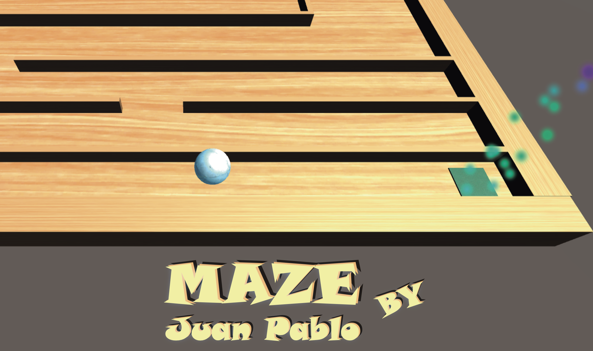
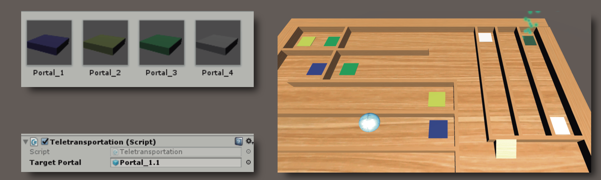

  

You must find the exit to go to the next level, but it will not be so easy, because you will have to think which way to
take to reach the end, you must use the portals located in the scene to avoid the walls.

**You can add more portals by creating a simple cube and attach the Teletransporatation Script, then, you have to
reference target portal Game Object. When the player collides with the portal, it will be teletransported to the
position’s target portal and vice versa**

  

